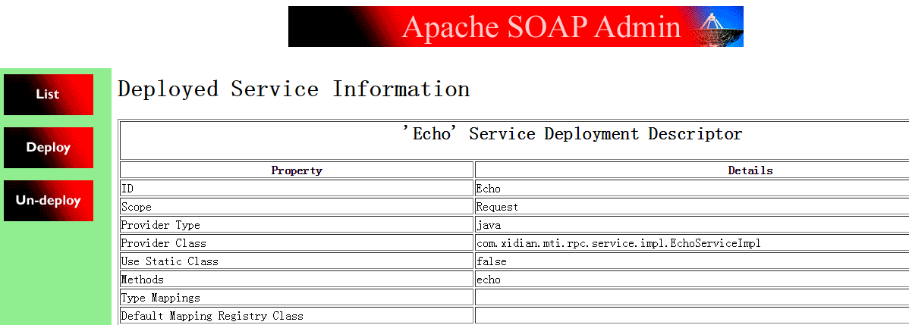

# RPC总结

## 功能目标

RPC的主要功能目标是让构建分布式计算应用更容易，在提供强大的远程调用能力时不损失本地调用的语义简洁性。为实现该目标，RPC框架需提供一种透明调用机制让使用者不必显式的区分本地调用和远程调用。

## 调用分类

**同步调用**
客户端等待调用执行完成并返回结果；

**异步调用**
客户调用后不必等待执行结果返回，但依然可以通过回调通知等方式获取返回结果。若客户端不关系调用返回结果，则变成单向异步调用，单向调用不用返回结果。

## 结构分析

RPC 服务方通过 RpcServer 去导出（export）远程接口方法，而客户方通过 RpcClient 去引入（import）远程接口方法。客户方像调用本地方法一样去调用远程接口方法，RPC 框架提供接口的代理实现，实际的调用将委托给代理RpcProxy 。代理封装调用信息并将调用转交给RpcInvoker 去实际执行。在客户端的RpcInvoker 通过连接器RpcConnector 去维持与服务端的通道RpcChannel，并使用RpcProtocol 执行协议编码（encode）并将编码后的请求消息通过通道发送给服务方。

RPC 服务端接收器 RpcAcceptor 接收客户端的调用请求，同样使用RpcProtocol 执行协议解码（decode）。解码后的调用信息传递给RpcProcessor 去控制处理调用过程，最后再委托调用给RpcInvoker 去实际执行并返回调用结果。

## 组件职责

**RpcServer** 
负责导出（export）远程接口；

**RpcClient**
负责导入（import）远程接口的代理实现；

**RpcProxy**
远程接口的代理实现；

**RpcInvoker**
客户方实现：负责编码调用信息和发送调用请求到服务方并等待调用结果返回；服务方实现：负责调用服务端接口的具体实现并返回调用结果；

**RpcProtocol**
负责协议编/解码；

**RpcConnector**
负责维持客户方与服务方的连接通道和发送数据到服务方；

**RpcAcceptor**
负责接收客户方请求并返回请求结果；

**RpcProcessor**
负责在服务方控制调用过程，包括管理调用线程池，超时时间等；

**RpcChannel**
数据传输通道。

## 相关知识储备

### SOA

SOA是面向服务的软件架构（Service Oriented Architecture），是一种计算机软件的设计模式，主要应用于不同应用组件中某种协议来互相操作，例如典型的通过网络协议。因此SOA是独立于任何厂商、产品与技术的。SOA作为一种架构依赖于服务的方向，它的基本设计原理是：服务提供了一个简单的接口，抽象了底层的复杂性，然后用户可以访问独立的服务，而不需要去了解底层平台的实现。其实现包括：

- SOAP, RPC
- REST
- DCOM
- CORBA
- OPC-UA
- Web Services
- DDS
- Java RMI

因此，REST、SOAP、RPC和DCOM等都是SOA的一种实现而已。

### ICE

ICE（Internet Communications Engine）是ZeroC提供的一款高性能的中间件，基于ICE可以实现电信级的解决方案。基于ICE的数据层可以在未来方便的进行扩展，ICE支持分布式的部署管理，消息中间件以及网格计算。其产生来源于.NET、CORBA和Web Service这些中间件的不足，它可以支持不同的系统，如Windows、Linux等，也可以支持多种开发语言使用，如C++、C、Java、Python等，服务器可以是上面提到的任何一种语言实现的，客户端也可以根据自己的实际情况选择不同的语言去实现，如服务器端采用C语言实现，而客户端采用Java语言实现，底层的通信逻辑通过ICE的封装实现，我们只关系业务逻辑。

### SOAP

SOAP（Simple Object Access Protocol）简单对象访问协议，是一个通信协议，SOAP在HTTP协议的基础上，把编写成的XML的Request参数，放在Http请求体上提交到Web Server处理完成后，结果也写成XML作为Response送回客户端，为了使用户端Web Service可以相互对应，可以使用WSDL作为这种通信方式的描述文件，利用WSDL工具可以自动生成WS和用户端的框架文件，SOAP具备把复杂对象序列化捆绑到XML的能力。
SOAP的前身是RPC，这个协议安全性不是很好，多数防火墙都会阻挡RPC的通信包，而SOAP则使用HTTP协议作为基本的协议，使用端口80使得SOAP可以透过防火墙，完成RPC的功能。

### Web Service

Web Service是建立在可互操作的分布式应用程序的新平台。其是一种标准，它可以通过SOAP和REST的方式来实现，传统的SOAP-WebService使用了SOAP协议（基于XML封装）等。如果使用Restful-WebService的话，则不需要SOAP与之相关的协议，而是通过最简单的HTTP协议传输数据（包括XML和JSON），既简化了设计也减少了网络传输量。其有几个相关概念：

**WSDL**：网络服务描述语言是Web Service的描述语言，它包含了一系列的描述某个Web Service的定义。
**UDDI**：是一种目录服务，企业可以使用它对Web Service进行注册和搜索。

### REST与SOAP

REST（Representational State Transfer）是一种轻量级的Web Service架构，可以完全通过HTTP协议实现。其实现和操作比SOAP和XML-RPC更为简洁，还可以利用缓存Cache来提高响应速度，性能、效率以及易用性上面都优于SOAP协议。REST架构对资源的操作包括获取、创建、修改和删除的操作正好对应HTTP协议的GET、POST、PUT和DELETE方法。

**REST、SOAP和XML-RPC三种方案的比较**

XML-RPC已慢慢的被SOAP所取代，现在很少采用。从以下几点比较：

- 成熟度：SOAP在成熟度上优于REST；
- 效率和易用性：REST更胜一筹；
- 安全性：SOAP安全性高于REST，因为REST更关注的是效率和性能问题；

总体上，因为REST模式的Web服务与复杂的SOAP和XML-RPC对比来讲具有更明显的简洁，越来越多的Web服务开始采用REST风格设计和实现。REST对于资源型接口来讲很合适，同时特别适合对于效率要求很高，但是对于安全要求不高的场景。而SOAP的成熟性可以给需要提供更多开发语言的，对于安全性要求较高的接口设计带来便利。

## RPC应用

所有模块中，凡是出现9000端口皆为依赖配置中添加Jetty插件并指定其开启端口为9000。若与用户本地端口存在冲突，可到相应模块中的 `pom.xml` 中自行更改。

### XML-RPC

XML-RPC的定义是工作在互联网上的远程过程调用协议，它可以允许软件运行在分布式的系统之上，通过互联网进行软件程序之间的调用，其传输协议是HTTP，传送数据编码格式是XML，由于是通过HTTP传输数据，因此基于XML-RPC的软件不受操作环境、编程语言等限制，由于是通过HTTP协议传输，因此可以通过防火墙的限制，具有简单易用等特点。XML-RPC只是一个协议，Apache的XML-RPC是开源的一个实现。其缺点如下：

- XML-RPC的消息系统过于简单，没有完整意义上的消息模型；
- XML-RPC调用服务的方式要求直接指定对象和方法，称不上完整的面向服务的体系；
- XML-RPC服务器端提供的服务实际上是特定对象的某个方法，限制了服务器端的开发。

**安装和运行**

    mvn clean install
    mvn jetty:run

**测试用例中访问**

测试用例需要访问的地址为：`http://192.168.2.201:9000/xml-rpc/echo`，端口修改需要更改[`pom.xml`](./xml-rpc/pom.xml)中Jetty插件的端口，访问地址的配置文件为：[`service-config.properties`](./xml-rpc/src/main/resources/service-config.properties)。

### JSON-RPC

**安装和运行**

    mvn clean install
    mvn jetty:run

**测试用例中访问**

测试用例需要访问的地址为：`http://192.168.2.201:9000/json-rpc/echo`，端口修改需要更改[`pom.xml`](./json-rpc/pom.xml)中Jetty插件的端口，访问地址的配置文件为：[`service-config.properties`](./json-rpc/src/main/resources/service-config.properties)。

### REST-RPC

**安装和运行**

    mvn clean install
    mvn jetty:run

**访问**
    
访问名称：`http://localhost:9000/rest-rpc/rest/user/name/daqinzhidi`

访问年龄：`http://localhost:9000/rest-rpc/rest/user/age/24`

### SOAP-RPC

**安装与运行**

    mvn clean install
    
拷贝 [`soap.war`](./soap-rpc/src/main/resources/soap.war)，放入`Tomcat`中的`webapps`目录下，通过本地启动`Tomcat`，并且在地址栏中输入 `http://localhost:8090/soap/admin` 便可进入`SOAP`服务的主页面（其中端口`8090`为作者的`Tomcat`服务端口，如有不一致，用户可自行更改访问端口），在此需要点击`Deploy`菜单来进行`SOAP`服务的发布页面，并如下图进行简单的服务配置：

部署成功之后，然后通过如下命令开启本地服务器：

    mvn jetty:run
    
在浏览器中输入访问地址：`http://localhost:9000/soap-rpc/echo`，最终页面如果出现 `SOAP测试客户端，接收到响应为：大秦之帝`，即完成了一次`SOAP`远程服务调用的过程。如果用户的`Tomcat`端口不是`8090`，需要修改配置文件[`service-config.properties`](./soap-rpc/src/main/resources/service-config.properties)中的`endpoint`所对应的端口号。

**出现问题**

在此需要着重说明一个问题，作者直接通过在地址栏输入访问地址后，未能出现预期的结果，检查时发现出现错误：`SOAP-ENV:Server.BadTargetObjectURI`，最终解决方案是将由`mvn clean install`命令编译后的字节码文件放入`Tomcat`的 `webapps`目录下的 `soap\WEB-INF\classes\`中，必须带完整包路径，如`soap\WEB-INF\classes\com\xidian\mti\rpc\service\impl\EchoServiceImpl.class`，然后重新启动Tomcat，在浏览器输入访问地址便可出现预期结果。